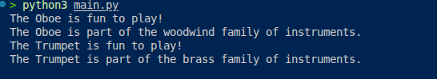

# Musical Instrument Inventory - OOP Python Project

A simple Object-Oriented Programming (OOP) demonstration in Python featuring a `MusicalInstrument` class.

## Overview

This project demonstrates core OOP concepts in Python, including:

- Class definition
- Constructor (`__init__`)
- Instance attributes
- Methods
- Object creation and interaction

## Features

- Create musical instruments with a name and type (e.g., woodwind, brass, string, etc.)
- Play the instrument (with a fun message)
- Get interesting facts about the instrument

## Technologies Used

- Python3

## Project Structure

``` tree
musical-instruments/
├── main.py                 # Main script (or instrument_demo.py)
└── README.md
```

## Installation & Setup

1. **Clone the repository** (if on GitHub):

   ```bash
   git clone <-this-repository-url>
   cd musical_instrument_inventory
   ```

2. No external dependencies required! Just Python 3 installed.

## Usage

Run the script:

```bash
python3 main.py
```

### Example Output

``` text
The Oboe is fun to play!
The Oboe is part of the woodwind family of instruments.
The Trumpet is fun to play!
The Trumpet is part of the brass family of instruments.
```

## Code Example

```python
class MusicalInstrument:
    def __init__(self, name, instrument_type):
        self.name = name
        self.instrument_type = instrument_type

    def play(self):
        print(f"The {self.name} is fun to play!")

    def get_fact(self):
        return f"The {self.name} is part of the {self.instrument_type} family of instruments."


# Creating objects
instrument_1 = MusicalInstrument("Oboe", "woodwind")
instrument_2 = MusicalInstrument("Trumpet", "brass")

instrument_1.play()
print(instrument_1.get_fact())
```

## Learning Objectives

This project helps understand:

- How to design and implement a simple class
- Difference between class and objects
- Encapsulation (bundling data and methods)
- Reusability through classes

## Future Improvements (Ideas)

- Add more methods (e.g., `tune()`, `get_sound()`)
- Implement inheritance (e.g., `WoodwindInstrument`, `BrassInstrument`)
- Add a list of instruments and a simple menu system
- Store instruments in a JSON file
- Create a small GUI using Tkinter or Streamlit

## License

This project is open-source and available under the [MIT License](LICENSE).

---

- **Made with ❤️ for learning OOP in Python**

### Program Output


